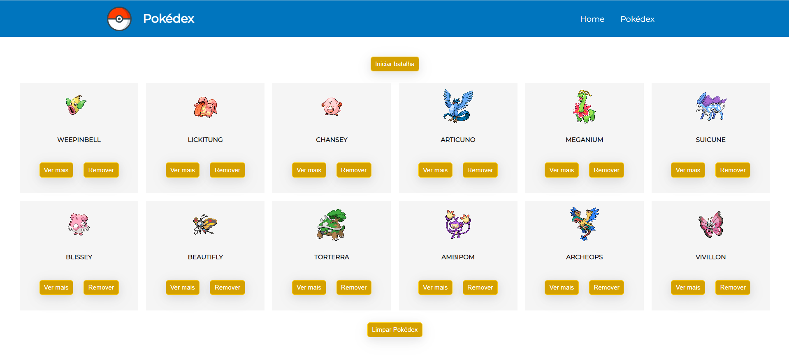
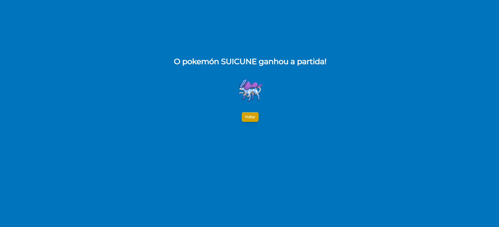
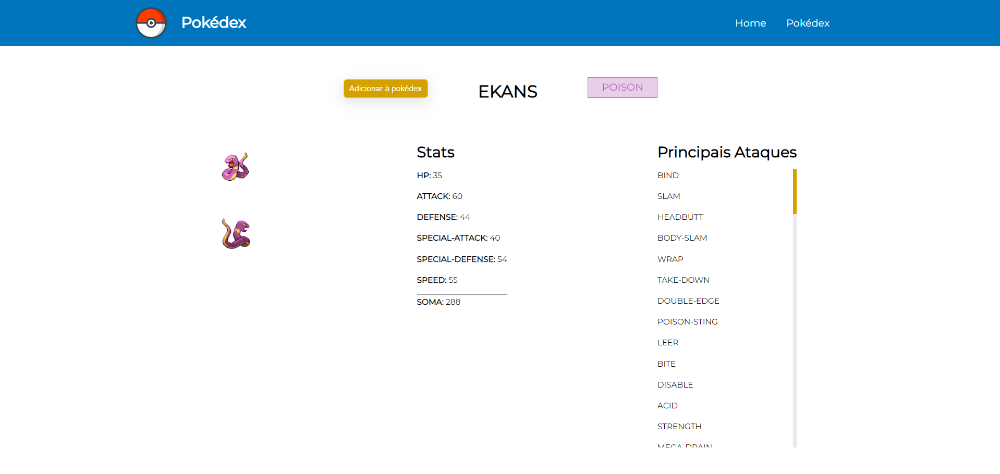

# POKEDEX

## Nome dos integrantes: 
- Francine Hahn
- Giovana Inez Vieira
- Maria Fernandez de Moura Ferro

## Link do Surge: www.link.com.br

## O que funciona:
- Requisição de todos os pokémons disponíveis na API;
- Botão "adicionar à pokédex" e "ver mais" em cada card de pokémon;
- Ao adicionar pokémon à pokédex, ele fica salvo no local storage e deixa de ser renderizado na página inicial;
- Botão "remover da pokedéx": pokémon deixa de ser renderizado na pokédex e volta para a página inicial;
- Botão "limpar pokédex": exclui todos os pokémons da pokédex;
- Botão "iniciar batalha": usuário pode selecionar 2 pokémons para se enfrentar; o pokémon com maior soma das stats vence;

## O que não funciona: 
- Item 3
- Item 4

## Imagens:

